# UniFeed Technical Specification

**Author**: Jordan Tallon

# Table of Contents

- [1. Glossary](#1-glossary)
- [2. Overview](#2-overview)
- [3. Relevant Academic Papers](#3-relevant-academic-papers)
- [4. High Level Design](#4-high-level-design)
   * [4.1. System Overview](#41-system-overview)
   * [4.2. The UniFeed Web App](#42-the-unifeed-web-app)
   * [4.3. The UniFeed Political Bias Detection Model](#43-the-unifeed-political-bias-detection-model)
      + [4.3.1. Technology Stack](#431-technology-stack)
   * [4.4. Third Party Services](#44-third-party-services)
   * [4.5. Dataflow Diagram](#45-dataflow-diagram)
   * [4.6. Class Diagram](#46-class-diagram)
   * [4.7. Machine Learning Graphical Abstract](#47-machine-learning-graphical-abstract)
   * [4.8. Deployment Diagram](#48-deployment-diagram)
- [5. System Architecture](#5-system-architecture)
   * [5.1. The UniFeed Web App](#51-the-unifeed-web-app)
      + [5.1.1. Backend Architecture](#511-backend-architecture)
      + [5.1.2. Frontend Architecture](#512-frontend-architecture)
      + [5.1.3. Web App Architecture Diagram](#513-web-app-architecture-diagram)
   * [5.2. Account Management](#52-account-management)
      + [5.2.1. Functional Requirements](#521-functional-requirements)
      + [5.2.2. Implementation](#522-implementation)
      + [5.2.3. Account Management Use Case Diagram](#523-account-management-use-case-diagram)
   * [5.3. Feed Management](#53-feed-management)
      + [5.3.1. Functional Requirements](#531-functional-requirements)
      + [5.3.2. Implementation](#532-implementation)
      + [5.3.3. Feed Management Sequence Diagram](#533-feed-management-sequence-diagram)
   * [5.4. Folder Management](#54-folder-management)
      + [5.4.1. Functional Requirements](#541-functional-requirements)
      + [5.4.2. Implementation](#542-implementation)
   * [5.5. Article Management](#55-article-management)
      + [5.5.1. Functional Requirements](#551-functional-requirements)
      + [5.5.2. Implementation](#552-implementation)
      + [5.5.3. Feed / Article Entity Relationship Diagram](#553-feed-article-entity-relationship-diagram)
   * [5.6. Political Bias Analysis](#56-political-bias-analysis)
      + [5.6.1. Functional Requirements](#561-functional-requirements)
      + [5.6.2. Implementation](#562-implementation)
      + [5.6.3. Web Scraping Activity Diagram](#563-web-scraping-activity-diagram)
      + [5.6.4. ArticleAnalysisResults State Diagram](#564-articleanalysisresults-state-diagram)
- [6. Machine Learning Methods](#6-machine-learning-methods)
   * [6.1. Datasets](#61-datasets)
      + [6.1.1. BABE Dataset](#611-babe-dataset)
      + [6.1.2. MBIB 'political-bias' Dataset](#612-mbib-political-bias-dataset)
   * [6.2. Dataset Integration](#62-dataset-integration)
      + [6.2.1. Feature Selection](#621-feature-selection)
      + [6.2.2. Combining the BABE and 'political-bias' Datasets](#622-combining-the-babe-and-political-bias-datasets)
   * [6.3. Dataset Analysis](#63-dataset-analysis)
      + [6.3.1. Overview](#631-overview)
      + [6.3.2. Sentence Length Distribution](#632-sentence-length-distribution)
   * [6.4. Dataset Cleaning](#64-dataset-cleaning)
      + [6.4.1. Removal of Entries with Missing Values](#641-removal-of-entries-with-missing-values)
      + [6.4.2. Removal of Duplicate Entries](#642-removal-of-duplicate-entries)
      + [6.4.3. Removal of Skewed Entries](#643-removal-of-skewed-entries)
   * [6.5. Dataset Balancing](#65-dataset-balancing)
   * [6.6. Advanced Dataset Analysis](#66-advanced-dataset-analysis)
      + [6.6.1. Overview](#661-overview)
      + [6.6.2. Sentence Length Distribution](#662-sentence-length-distribution)
      + [6.6.3. Distribution of Sentences Containing an Entity](#663-distribution-of-sentences-containing-an-entity)
      + [6.6.4. Count of Entity Types Mentioned in Sentences](#664-count-of-entity-types-mentioned-in-sentences)
   * [6.7. Adjective Usage Across Political Ideologies](#67-adjective-usage-across-political-ideologies)
      + [6.7.1. Word Clouds Showing Most Common Adjectives Per Label](#671-word-clouds-showing-most-common-adjectives-per-label)
      + [6.7.2. Overlap of Adjective Usage Across All Ideology Labels](#672-overlap-of-adjective-usage-across-all-ideology-labels)
   * [6.8. Model Training](#68-model-training)
      + [6.8.1. Overview](#681-overview)
   * [6.9. Evaluation Metrics](#69-evaluation-metrics)
   * [6.10. Evaluation Results](#610-evaluation-results)
   * [6.11. Limitations / Biases](#611-limitations-biases)
   * [6.12. Reproducibility](#612-reproducibility)
      + [6.12.1. Training Hyperparameters](#6121-training-hyperparameters)
      + [6.12.2. Framework Versions](#6122-framework-versions)
      + [6.12.3. Library Versions](#6123-library-versions)
      + [6.12.4. Dataset Split](#6124-dataset-split)
- [7. Deployment and Testing](#7-deployment-and-testing)
   * [7.1. Dockerization](#71-dockerization)
      + [7.1.1. UniFeed Dockerfile](#711-unifeed-dockerfile)
      + [7.1.2. Proxy Dockerfile](#72-proxy-dockerfile)
      * [7.1.3. Docker-Compose](#721-docker-compose)
   * [7.2. CI/CD Pipeline](#73-cicd-pipeline)
   * [7.3. Unit Tests](#74-unit-tests)
      + [7.3.1. Accounts Tests](#741-accounts-tests)
      + [7.3.2. AI Analysis Tests](#742-ai-analysis-tests)
      + [7.3.3. Articles  Tests](#743-articles-tests)
      + [7.3.4. Feeds Tests](#744-feeds-tests)
- [8. Problems and Resolutions](#8-problems-and-resolutions)
   * [8.1. Scalability and Performance ](#81-scalability-and-performance)
      + [8.1.1. Problem](#811-problem)
      + [8.1.2. Solution](#812-solution)
   * [8.2. Continuous AI Improvement ](#82-continuous-ai-improvement)
      + [8.2.1. Problem](#821-problem)
      + [8.2.2. Solution](#822-solution)
   * [8.3. Scraping Target Variation](#83-scraping-target-variation)
      + [8.3.1. Problem](#831-problem)
   * [8.4. Solution](#84-solution)
- [9. Installation Guide](#9-installation-guide)
   * [9.1. Prerequisites](#91-prerequisites)
   * [9.2. Installation Steps](#92-installation-steps)

# 1. Glossary

**RSS (Really Simple Syntax):** A web feed that allows users and applications to access updates to websites in a standardized, computer-readable format.

**TTL (Time to Live):** Used by UniFeed in the context of RSS feeds, it is a value which dictates in minutes the recommended frequency at which you should poll the RSS feed. 

**NLP (Natural Language Processing):** A branch of AI related to human language.

**Dockerized:**  The process of packing an application into a Docker container.

**Robots.txt**: Robots exclusion standard. A file hosted on a website that sets rules for visiting web crawlers on the actions they are allowed to take and the website paths they are allowed to visit.

**WSGI (Web Server Gateway Interface):** Protocol interface between servers and Python web applications.

**ORM(Object Relational Mapper):**  Enables Django projects to interact with a database using Python objects instead of SQL queries.

# 2. Overview

UniFeed is an AI driven news aggregation app. The platform allows users to import news articles from their chosen RSS feeds. It uses asynchronous tasks to regularly poll the RSS feeds and keep them up to date based upon their TTL. The platform is designed to be a one-stop location for users to view the latest articles from all their favourite news.

UniFeed utilizes machine learning to promote a better informed media consumption. It offers an A.I tool that is capable of analysing news articles and detecting the presence of political bias in the contents of the article. The analysis focuses on sentences, where it aims to detect biased sentences, highlight them, and provide an overall bias prediction for the article based upon the ratio of biased sentences. 

UniFeed is a comprehensive web application built using the Django framework. It is fully Dockerized and makes thorough use of automated testing with a full Jenkins CI/CD pipeline and over 50 unit tests.  

# 3. Relevant Academic Papers

These papers served as a foundation for strategizing how UniFeed's machine learning will attempt to identify political bias in text.

[Neural Media Bias Detection Using Distant Supervision With BABE - Bias Annotations By Experts](https://aclanthology.org/2021.findings-emnlp.101.pdf)

[Introducing MBIB - The First Media Bias Identification Benchmark Task and Dataset Collection](https://dl.acm.org/doi/pdf/10.1145/3539618.3591882)

[Detecting political biases of named entities and hashtags on Twitter]()

[In Plain Sight: Media Bias Through the Lens of Factual Reporting](https://aclanthology.org/D19-1664.pdf)

**Key Takeaways**
* Media bias by word choice rarely depends on context outside the sentences
* Adjectives play a crucial role in conveying sentiment, opinion, and bias.
* Named entities like people, organizations, and locations are often the subjects of biased statements.

# 4. High Level Design

## 4.1. System Overview

The UniFeed system is structured around two major components: 
1. The UniFeed web app
2. The UniFeed political bias detection model

## 4.2. The UniFeed Web App

The web app was developed in the Django framework. It is made up of five principal components, referred to as an 'App' within the Django environment:
 
**Accounts App**
Handles user authentication, registration and account settings.

**AI Analysis App**
Provides an API that is responsible for ML model integration. 
* Asynchronously handles requests for political bias analysis.
* Extracts ideal candidate sentences from scraped text using NLP.
* Passes sentences to the ML model, and returns the analysis results to the requester. 

**Scraper App**
Responsible for reading articles from RSS feeds and extracting text content from an article. 
* Adaptable to different article HTML structures.
* Scrapes ethically by respecting robots.txt files.

**Feeds App**
Manages feeds and related functionalities
* Regularly polls the feeds for updates.
* Signals Articles app when new articles are found.

**Articles App**
Manages article related functionalities. 
* Handles the creation, retrieval, and display of article information.
* Manages the relationship between articles and their respective feeds.
* Keeps track of personalized user experiences such as 'Recently Read' and 'My Reading List'

## 4.3. The UniFeed Political Bias Detection Model

The political bias detection model uses a model trained on sentences to classify sentences into three categories of political bias: 'Left', 'Right', and 'Center'. It makes use of two different datasets published by the Media Bias Group (MBG). Both datasets were  analysed, cleaned, integrated together and balanced to ensure quality. The model is trained on the combined dataset to recognize linguistic bias indicators that may be present in sentence embeddings. 

The model is hosted on the ML platform HuggingFace. The pipeline for the political bias detection comprises data acquisition through the UniFeed web app via web scraping, selective analysis of candidate sentences for bias analysis, and individual sentence analysis through the HuggingFace inference API.

### 4.3.1. Technology Stack

**Development Stack**
- **Django**: Primary web framework for backend development.
- **Django Rest Framework**: API Framework.
- **Bootstrap 5.0**: Frontend Framework.
- **HTMX**: Dynamic Frontend content updates.
- **Docker**: Containerization.
- **Celery**: Asynchronous task queue/job queue used for background tasks.
- **Redis**: In-memory data structure store used as a message broker and cache for Celery tasks. 
- **Jenkins**: Automation server for continuous integration and deployment.
- **Git**: Version control system.
- **pytest/factory_boy/faker**: For writing and executing unit tests.
- **Coverage**: For measuring unit test code coverage.

**Deployment Stack** 
- **NGINX**: HTTP and reverse proxy server.
- **uWSGI**: Gateway interface for NGINX and Django communication.
- **PostgreSQL**: Database / Data management.
- **Docker/Docker Compose**: For running multi-container Dockerized UniFeed services.
- **Celery with Redis**: Used for handling background tasks in the production environment.

## 4.4. Third Party Services

* **HuggingFace** For hosting the UniFeed political bias model and inference API.
* **DigitalOcean** For hosting the UniFeed web app, Jenkins server and Database.

## 4.5. Dataflow Diagram

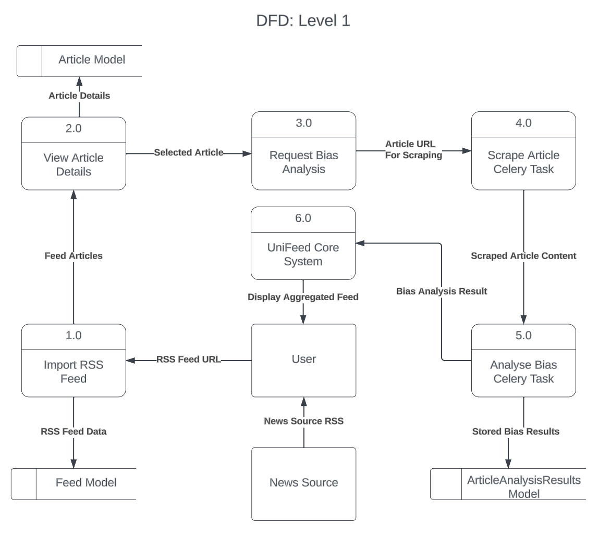

## 4.6. Class Diagram

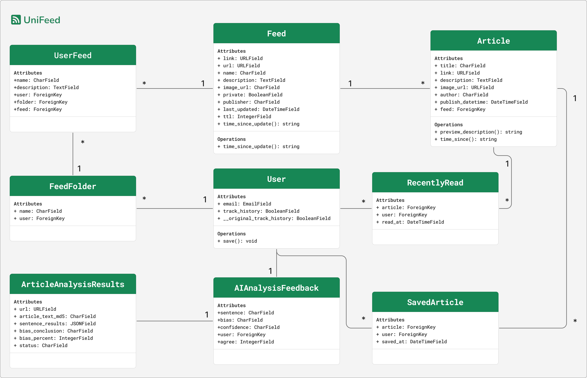

## 4.7. Machine Learning Graphical Abstract

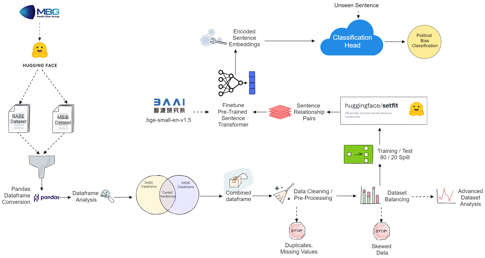

## 4.8. Deployment Diagram

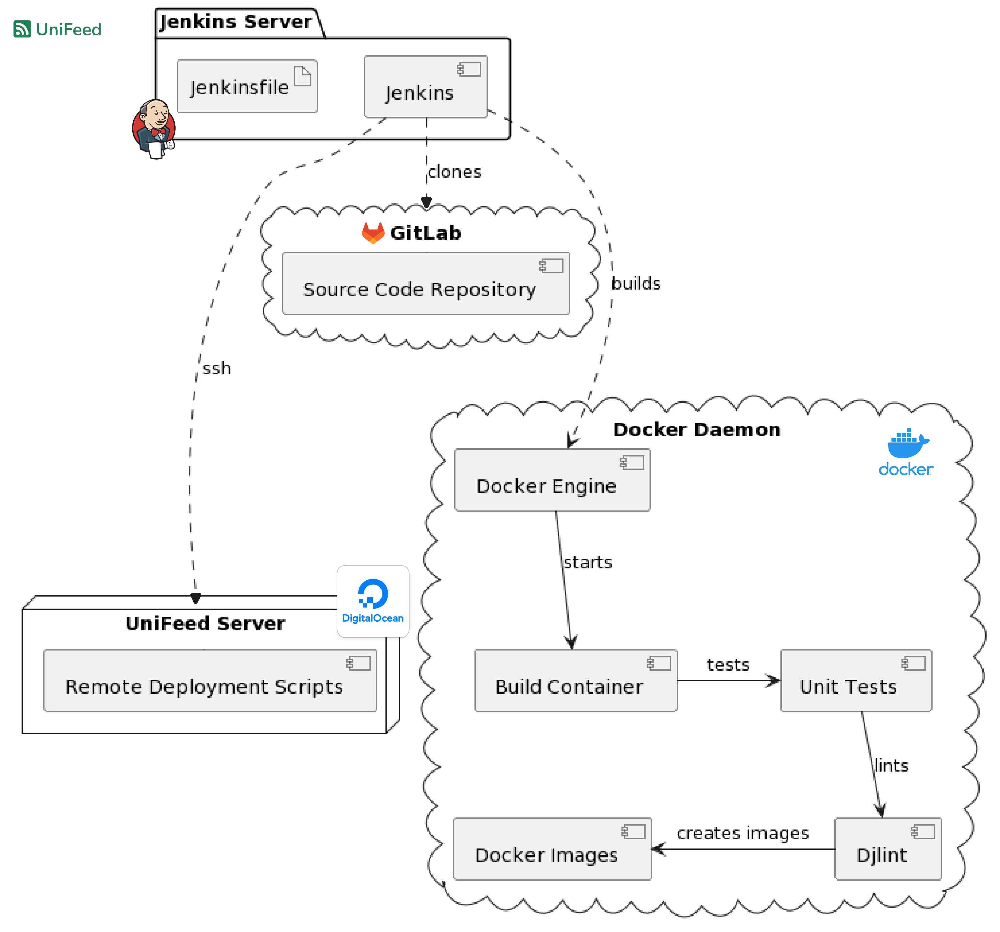

# 5. System Architecture

## 5.1. The UniFeed Web App

### 5.1.1. Backend Architecture

**Web Framework**
* **Django:** server side full stack framework, handles the communication between different modules, facilitates database management (using the ORM model for abstraction), server side HTML rendering, and URL route management.

**Content Delivery**
* **Nginx:** used for live deployment of the web app. Nginx runs multiple workers that can deliver static content from the server acting as a reverse proxy and load balancer to many users at once.
* **uWSGI:** serves as an application server that runs the Django project and communicates with Nginx using the WSGI protocol.
* **Django Rest Framework:** Framework for Django to efficiently utilize REST.
* **Celery:** provides workers to handle background tasks asynchronously. Primarily used in UniFeed for API functionality, such as feeding content to the political bias detection model. Celery greatly improves the platforms scalability so that many users can run the political bias detection at once with variance in performance and processing times. The system will remain responsive under the load as Celery is asynchronous and does not obstruct the main thread of the server.
* **Redis:** acts as a message broker to manage task queues that Celery workers can retrieve and execute.

**Third Party Systems**
* **Digital Ocean:** provides servers that are used for the deployment of the UniFeed web app.

### 5.1.2. Frontend Architecture

**Template Framework**
* **Django**: ships with a built-in template system for frontend delivery of HTML content. The frontend requirements for the UniFeed project were quite simple and did not stand to benefit from integrating a frontend framework such as React, Angular or Vue.js. Instead, the focus was maintained on creating a simple yet effective frontend that focused on ease of: integration, debugging, testing, and deployment. This decision helped to avoid additional complexity and maintain a straightforward rapid development process that adheres to both the scope and time constraints of the project.

**Frontend Framework**
* **HTMX:** employed for its ability to dynamically poll the API. HTMX allowed for dynamic content updates with minimal overhead and integration into the Django templates. Its utilization ensured that the platform could deliver real-time, interactive content where necessary (such as the political bias detection results) whilst maintaining the simplicity of the Django architecture.
* **Bootstrap:**  used primarily for its utility classes to help structure the pages. Using Bootstrap allowed for creating a fully mobile responsive web app with relative ease compared to a traditional CSS only approach.
* **Animate.style:** Lightweight CSS animation library, used for fade and pop in effects.
* **JavaScript:** Used to add interactivity, Bootstrap functions, and animate.style animations to the UniFeed web app, helping to create a dynamic and responsive user interface. In conjunction with HTMX, JavaScript helps in managing content updates, contributing to the functionality of real-time features like the political bias detection results.

### 5.1.3. Web App Architecture Diagram

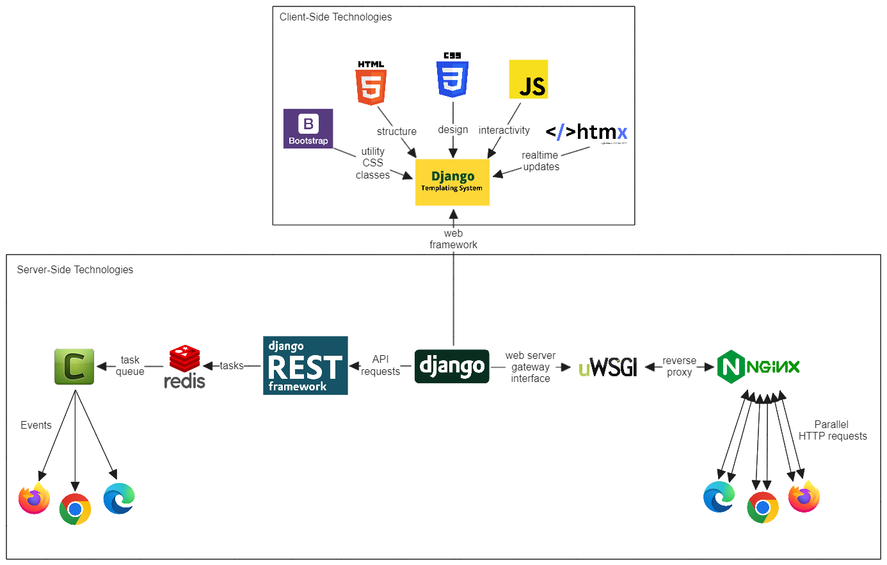

## 5.2. Account Management

### 5.2.1. Functional Requirements

1. **User Account System:** Users can create a personal account by providing a username, their email, and a password. The account will hold data that is crucial for providing a tailored experience to the user such as their:
	- Imported RSS feeds.
	- Saved articles.
	- Personal Reading list.

### 5.2.2. Implementation

1. **Register:** The `account_register` view handles new user registrations. It uses a `UserRegistrationForm` to collect user input for username, email, and password. Upon POST request, if the form is valid, it saves the new user to the database and redirects to the login page.
2. **Login:** The `account_login` view manages user logins. It uses a `UserLoginForm` and authenticates credentials. If authentication is successful, it logs the user in and redirects to the reading list.
3. **Logout:** The `account_logout` view logs out the user by calling the `logout` method from Django's authentication system and then redirects to the reading list.
4. **Account Settings:** The `account_settings` view allows users to modify their account settings. It is protected by the `login_required` decorator. The view uses `AccountSettingsForm` pre-populated with the user's current settings. Upon POST request with valid form data, it saves the changes and displays a success message.

### 5.2.3. Account Management Use Case Diagram

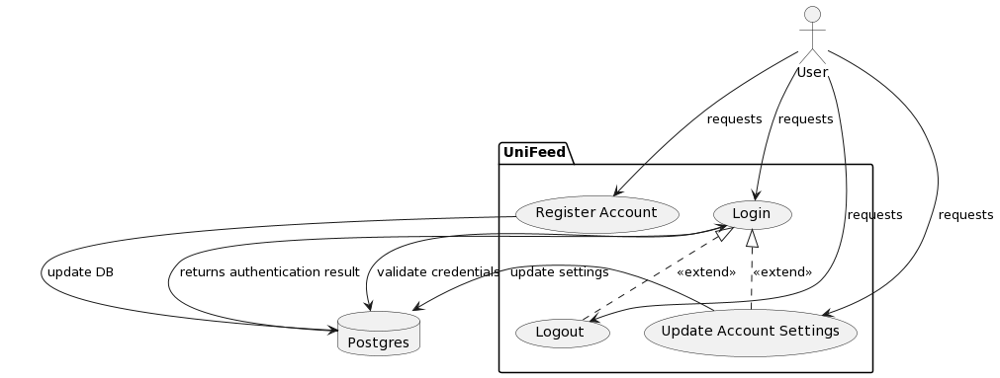

## 5.3. Feed Management

### 5.3.1. Functional Requirements

1. **Import RSS Feed:** Users can import custom feeds by providing the system with the URL of an RSS feed. This deploys the Web Scraping Service to read XML data from the feed and parse it into the system. Importing RSS feeds allows for users to customize their news feed based on personal interests, preferred news sources, or topics.
2. **Update RSS Feed:** The system must maintain existing RSS feeds ensuring that they are regularly updated with their latest entries. It is important that site tracks the latest feed developments to display to the user. The feeds shall be updated each time the user logs in or clicks a refresh button.
3. **Manage RSS Feed:** The user has the ability to modify or delete an existing feed. Modifying the feed will allow for the user to change the RSS URL, which is particularly useful if the feed changes location and the user wishes to maintain access without losing feed specific settings, such as its folder and associated articles. If the user elects to delete the RSS feed, the action will be accompanied by a prompt to inform the user about the permanent loss of data alongside a confirmation to prevent accidental deletion.

### 5.3.2. Implementation

**Models:** There are two feed related models: `Feed` and `UserFeed`. They both play a crucial role in satisfying the requirements. The `Feed` object contains core features of an RSS feed such as its `URL`, and `TTL` (update frequency). It also contains additional less important information such as its `name`, `description`, and `image_url`. The `UserFeed` model has a many to one relationship with the `Feed` model, where many `UserFeed` can subscribe to a single `Feed`. This is for a multitude of reasons:
1. The `UserFeed` has its own `name` and `description` fields that users can use to override customize the default name and description for the Feed provided by the RSS file.
2. Whenever a user imports a `Feed`, we can keep track of it as a single `Feed` object. For other users to also subscribe to this feed, a `UserFeed` instance will be created pointing to it. This means that each `Feed` is managed once for potentially 100s of users, offering a much more scalable and optimized approach to handling a large number of users subscribing to the same feed. Similarly, the articles will only need to associate with the core `Feed` object, and all `UserFeed` objects will pull from the same pool of articles.
3. The `UserFeed` is decoupled from the `Feed` object, meaning its settings can be preserved and updated if the `Feed` object is to be deleted.

**Import RSS Feed:** The user can import through two different means. They can choose to import from a list of feeds that are already on the website. This simply creates a new `UserFeed` pointing to that feed, allowing for them to quickly add their desired feed from a growing library. The other way is to import the RSS feed from a URL, where they must find the URL by themselves from their favourite news website or search engine. If they choose to import the feed through a URL, it will be added to UniFeed's catalogue of feeds, where others will be able to select it from the feed list.

**Update RSS Feed:** Once a feed is imported into UniFeed, the app adds it to a queue of feeds to be checked every minute. This is done by an asynchronous Celery beat task named `update_all_feed`. The task awakens every 60 seconds, iterates through every feed handled by UniFeed and checks if the time since the feed was last updated has exceeded its TTL. If so, it deploys the web scraper to fetch new information from the RSS URL.  

**Manage RSS Feed:** Each folder has a 'Manage Feeds' panel where the users can edit, delete, or view the feeds within the folder. This offers a form that allows users to edit or customize any `UserFeed` that belongs to them.

### 5.3.3. Feed Management Sequence Diagram

## 5.4. Folder Management

### 5.4.1. Functional Requirements

1. **Create Folder:** Allow for organizing different imported feeds into customizable folders. Users can create new folders to categorize their feeds based on topics, sources, or personal preferences.
2. **Display Folder:** Folders will generate subdirectories within the system to display the aggregation of the feeds within a folder. For example, visiting the directory `USER_ID/feeds/Nature` will display all feeds within the "Nature" folder to the user.
3. **Manage Folder:** Includes renaming existing folders and deleting them. Renaming a folder allows users to update its title to better reflect content or their personal preferences. Deleting a folder removes it from the user's account along with its associated feed categorization, but does not delete the feeds themselves.
4. **Add Feed to Folder:** Users have the ability to categorize their imported RSS feeds into folders. This can be done by selecting an existing folder or creating a new one during the feed import process.

### 5.4.2. Implementation

**Models:** `FeedFolder` represents a folder that is created by the user to categorize their feeds. It contains two fields: `name` - the name of the folder, and `user` - the user who created the folder. Each folder can contain multiple feeds. A `UserFeed` can only appear once in a folder, but the user can import the same feed into many of their folders at once.

**Create Folder:** The user has the option at any time to "Add a New Folder" where they are greeted with a form `FeedFolderForm` to enter the name of the new folder. This form submits a POST request that is captured by the articles.views `add_new_folder` function. This function associates the folder with the user, creates it, and saves it to the database. It returns a redirection to the user that loads the page to view the contents of the folder.

**Display Folder:** The `view_folder` view function is responsible for displaying the contents of a folder. The function can generate two different types of views depending on the context passed. If a `UserFeed.id` belonging to a `UserFeed` within the folder is present in the parameters, the view will generate a page containing only the articles of that particular feed. If no `UserFeed.id` is present, it will display the articles of all `UserFeed` objects belonging to the `Folder`.

**Manage Folder:** Folder management is carried out in two different ways:
1. `edit_folder` for renaming a folder
2. `delete_folder` for deleting it.
These options are present in a 'Manage Folder' dropdown in the top right when viewing a folder. They offer users complete control over their folder.

**Add Feed to Folder:** When the user is viewing a folder, they have two ways they can add a feed to the folder:
1. They can click on the 'Manage Folder' button where the option to 'Add New Feed' will appear.
2. Alternatively, they can select 'Add New Feed' in the sidebar at the bottom of where the folder's hierarchy of contained feeds is displayed.
This logic is handled by the Feeds app views and a `UserFeedForm` form.

## 5.5. Article Management

### 5.5.1. Functional Requirements

 1. **View Article Details:** Allows for users to view the details of the articles gathered from their feed. Article details will appear as a list item in a feed presented in chronological order from the articles publish date. If the user clicks on one of the list items, a modal will appear with the article details.
2. **View Recently Read Articles:** Allows users to access a list of articles they have recently read. When a user clicks to view a full article, it will be automatically added to their reading history. Users can then view a "Recently Read" feed that displays a chronological list of these articles.
3. **Add to Read List:** Allows users to add an article to a personal "Read List" for future reference. When browsing article details, the user will have the option to add it to this list. This is useful for when the user wants to engage with a particular article but at a later point in time.
4. **Save Article:** Allows users to save an article that they wish to archive. For example if someone read an article they really enjoyed they could add it to their saved articles to show their friend at a later day.

### 5.5.2. Implementation

**Models:** 
The `Article` model contains the following attributes: `
- `title` - the article headline
- `link` - points to the source of the article
- `description` - provided by the RSS feed, 
- `image_url` - if the article provided a headline image, otherwise falls back to the RSS image, 
- `author` - may not be provided by the RSS feed, 
- `publish_datetime` - when the article was released
- `feed` - the feed which the article belongs to. 
The model utilizes two helper functions: `preview_description()` and `time_since()` where the former generates a truncated article description of 15 words for UX purposes and the latter gets the relative time since the article's `publish_datetime` in human readable format, e.g. "2 hours ago", "1 week ago", etc. Note that an `Article` object is associated with a `Feed` and not a `UserFeed` so that many users subscribing to the same root `Feed` will query from a shared `Article` stash.

The `RecentlyRead` model associates an `Article` to a `User` if the article is part of their recently read list. It contains a `read_datetime` field to track when the user read the article.

The `SavedArticle` model is identical to the `RecentlyRead` model but with a `saved_at` field instead of the `read_datetime` field to track when the user added the article to their 'Reading List'.

**Importing Articles:**  `Article` objects are created by the `import_articles_from_feed` function, which handles the process of retrieving, cleaning, and saving the articles associated with the feed into the database. This process is triggered by the the `rss_feed_imported` signal emitted by the Feeds app signal dispatcher when it successfully parses an RSS feed. 
 
**View Article Details:** When the user visits a `UserFeed` view, all articles that are associated with the `UserFeed` through their mutual `Feed` relationship are displayed to the user as preview cards. The card are sorted by their publish date from newest to oldest. They contain the article's image, a short description, author, publisher, and relative time since the article was published. If the user clicks on a card, it takes them to a URL path: `/articles/view/article_id` where a `view_article` view generates a page displaying all article details alongside a "Read Full Article" button that directs the user to the original source page of the article.

 **View Recently Read Articles:**  An article is considered 'read' when the user clicks into view the full article. To implement this, when the user clicks on the "Read Full Article" button the `read_article` POST view is triggered. This view contains the following logic:
 1. If the user has enabled the read history option in their settings, create a `RecentlyRead` object associated to both the article, and the user. The `read_datime` field is populated with the current time. 
 2. Otherwise, do nothing.
 3. Redirect the user to the external link.
Note that the user can enable or disable the read history option in their settings at any time. If they disable the option, all articles in their "read history" will be deleted. The recently read list only tracks up to 20 `RecentlyRead` objects per user at a time.

**Add to Read List / Save Article:** When the user is viewing the article details, a button is created next to the title of the article. The button contains an icon of a book and a contextual hover popup: 'Add to Reading List' and 'Remove from Reading List' depending on if the article is current in the 'Reading List' or not. This button submits a `SaveArticleForm` form to as a POST to the `article_details` view. If the article is not in the 'Reading List' this function adds it, otherwise it removes it. The user can view the `/articles/reading_list/` page to view all articles they have saved for later in their 'Reading List'. 

### 5.5.3. Feed / Article Entity Relationship Diagram

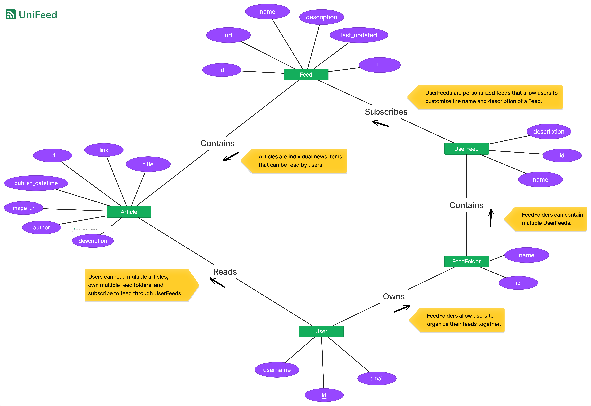

## 5.6. Political Bias Analysis

### 5.6.1. Functional Requirements

1. **Web Scraping Service:** The service can fetch XML or HTML data from a given URL. Primarily used to read RSS feed imports and the content of a given article. The scraper needs to be dynamic and capable of handling different structures, layouts, and well handle errors well for scenarios such as a URL containing no content.
2. **Detect Political Bias:** The system will employ a machine learning algorithm to assess and quantify the political bias in the text of selected news articles. This feature will enhance the users understanding of an article and promote informed reading. The algorithm will be trained on a dataset that contains left wing, right wing, and centre leaning sources to ensure a wide political spectrum and accurate classification.
3. **Provide A.I Feedback:** This feature allows users to give feedback on the AI's bias classification accuracy. When a user disagrees with the AI's assessment, they can submit their perspective, which the system records for review. This feedback loop is crucial for the continuous improvement of the A.I model.

### 5.6.2. Implementation

**Models:**
The `ArticleAnalysisResults` is responsible for initiating and tracking the progress of the politic bias analysis AI. It contains the following fields
- `url`: the URL of the article being analysed.
- `article_text_md5`: the MD5 hash of the article's text for caching results.
- `sentence_results`: a JSON field that stores the analysis results of each sentence, including their bias values.
- `bias_conclusion`: a character field that holds the overall bias conclusion based on the sentence results. For instance, if most sentences lean left, the conclusion would be 'left'.
- `bias_percent`: represents the percentage of sentences that led to the bias conclusion.
- `status`: indicates the status of the analysis, such as 'processing', 'complete', or 'failed'​​.

The `AIAnalysisFeedback` stores the feedback users leave for an AI analysis result. It contains the following fields:
- `sentence`:  the sentence that was analysed.
- `bias`: the predicted political bias for the sentence.
- `confidence`: the confidence level of the AI prediction.
- `user`:  the user who left the feedback.
- `agree`:  0 indicates the user disagrees with the result, and 1 indicates agreement.

**Web Scraping Service:** 

### 5.6.3. Web Scraping Activity Diagram

### 5.6.4. ArticleAnalysisResults State Diagram

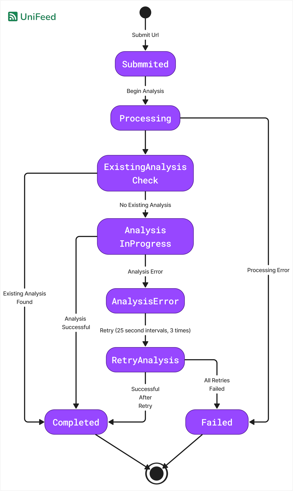

# 6. Machine Learning Methods

## 6.1. Datasets

### 6.1.1. BABE Dataset

The first dataset utilized in the model is BABE (Bias Annotations By Experts), as detailed in the research work "Neural Media Bias Detection Using Distant Supervision With BABE." In particular, the version 3 of the dataset is used which consists of 4,120 sentences carefully labelled by trained experts to offer a comprehensive dataset with balance amongst topics and outlets. The dataset contains the following fields:

| Field | Description |
| ---- | ---- |
| text | The sentence extracted from the political content. |
| news_link | A source link to the article where the entry originated. |
| outlet | The outlet which published the original article. |
| topic | The topic of the article. |
| type | The political alignment of the content: 'left', 'right', 'center', or 'nan'. |
| label | A binary label indicating whether the entry is biased or not (0 for unbiased, 1 for biased). |
| label_opinion | A label indicating the subjectivity of the entry, e.g., 'Entirely Factual', 'Writer's Opinion'. |
| biased_words | A list of words associated with political bias, derived from the MBG bias lexicon. |

### 6.1.2. MBIB 'political-bias' Dataset

The second dataset is the 'political-bias' dataset, which was published alongside the Media Bias Identification Benchmark (MBIB) paper which encompasses 22 carefully selected bias datasets. This dataset contains just two fields:

| Field | Description |
| ---- | ---- |
| text | The sentence extracted from the political content. |
| label | A binary label indicating whether the entry is biased or not (0 for unbiased, 1 for biased). |
## 6.2. Dataset Integration

### 6.2.1. Feature Selection

The primary goal of the model is to understand and analyse language used in news articles. The focus on the 'text' content and it's respective 'label' allow for the model to concentrate on the core content of the articles in an attempt to derive linguistic features associated with different political ideologies.

### 6.2.2. Combining the BABE and 'political-bias' Datasets

Only entries where the 'label' of the 'political-bias' dataset are equal to 0 (unbiased) are considered for use in our model. When the label is set to 1 (biased) this indicates that there is a 'left-wing' OR 'right-wing' bias for the given entry. For our model, we need to know the specific bias, that is, which political ideology the bias belongs to. This makes the biased content of 'political-bias' incompatible with our classification goals. The unbiased content (0) is equivalent to 'NOT left or right wing', which is compatible with the 'center' 'type' of the BABE dataset, where 'center' indicates that the bias is neither 'left' nor 'right'. This allows for us to integrate the 'political-bias' dataset to act as a donor for balancing the BABE dataset where there are missing 'center' entries. Combining the two datasets in this way allows for us to avoid techniques like oversampling which can lead to overfitting or loss of information.

## 6.3. Dataset Analysis

### 6.3.1. Overview

The Dataset Analysis steps were performed twice. An initial analysis was performed before cleaning to determine a strategy for the pre-processing steps. The aim of this step to explore the dataset for issues to address during the cleaning and balancing stages. Where relevant, a before and after illustration will be provided to demonstrate the impact the later stages had on the findings.

### 6.3.2. Sentence Length Distribution

To determine the length of each sentence, they were split up into words. The analysis will be based on the word count of the content.

**General Findings**

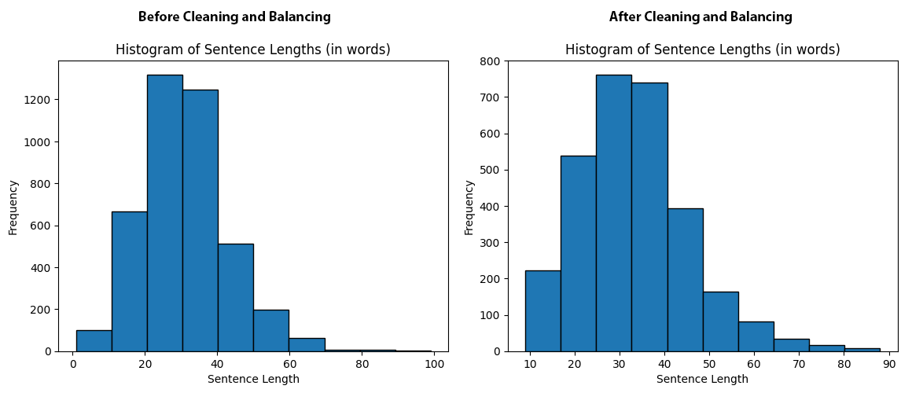

Most sentences fall within the 20-40 word length range. Specifically, the mean is 32.87, the min is 1 and the max is 99. The histogram on the left displays a min sentence length of 1, which indicates a data error in one of the entries as a sentence should be more than 1 word long.  

To further analyse the sentences with more than 70 words, a boxplot was created.

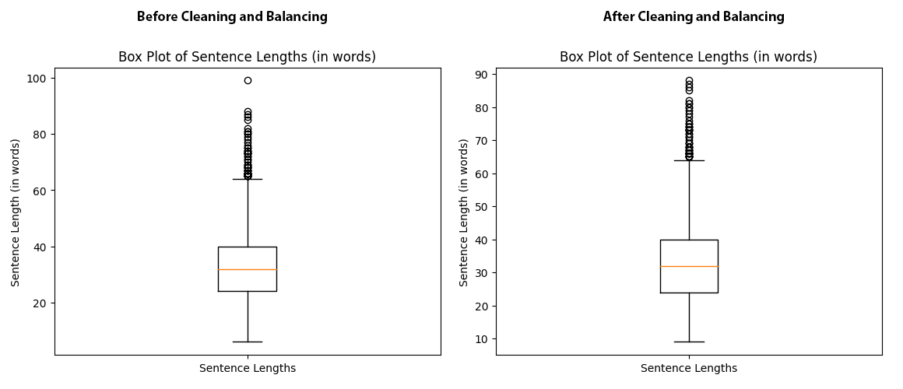

The Box Plot analysis revealed an outlier with a notably higher word count (99 words) compared to the rest of the dataset. This observation led to the decision to exclude this particular sentence. The motivation behind this choice was to maintain a more compact distribution of sentence lengths, particularly for longer sentences. The longer sentences may provide insights, such as a political affiliation being associated with longer sentences that this model wishes to retain. The outlier at 99 words is the only one of its sentence length, so it may falsely lead the model into associating very long sentences with its label due to its unique characteristics. The impact of this exclusion can be seen in the Box Plot on the right side of the figure, where the outliers are much better clustered.

## 6.4. Dataset Cleaning

### 6.4.1. Removal of Entries with Missing Values

**BABE Dataset**

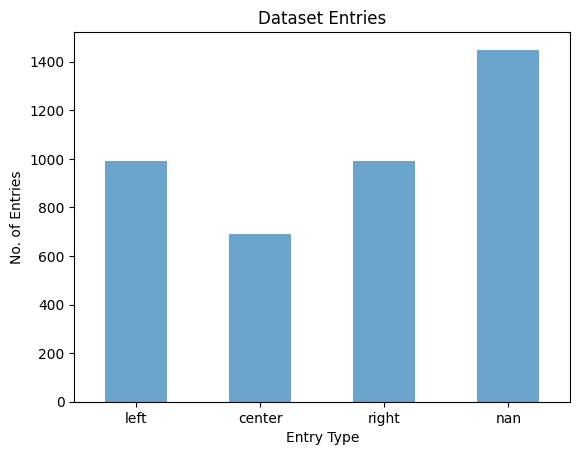

In the BABE dataset there are a large amount of entries with the value 'nan' as their political label. These are remnants of political sentences that contain information such as their biased words or subjectivity, but were not allocated a 'left', 'right', or 'center' label. For the purpose of the UniFeed model, these entries serve no purpose. 

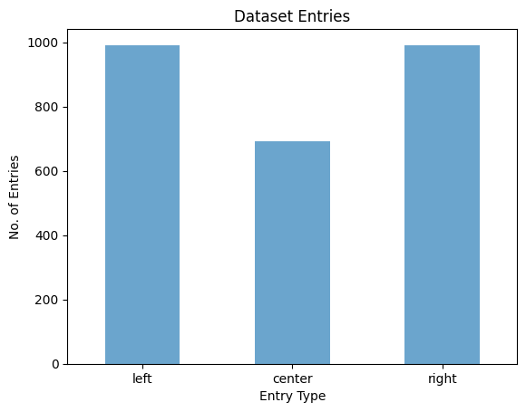

The 'nan' labelled entries are removed entirely from the dataset. This brought the dataset from 4,121 entries to 2,672 with a total loss of 1,449 'nan' entries.

**MBIB Political Bias Dataset**
For the second 'political-bias' DataFrame, this step was not necessary. During the Dataset integration step, only entries from the 'political-bias' Dataset with a label of 1 were preserved, which consequently discarded any entries that did not have a label value.

### 6.4.2. Removal of Duplicate Entries

**BABE Dataset**
All potential duplicate entries within the first DataFrame, BABE, were dropped with the drop strategy set to `keep=first`, where the first instance of a duplicate is preserved. Fortunately, the BABE dataset contained no duplicate entries. The same duplicate removal process was repeated for the second DataFrame, 'political-bias' which also ended up with no duplicate entries. This is an ideal result where no data was lost during the duplication removal process. 

**MBIB Political Bias Dataset**
To ensure that there are no collisions between the first and second Dataset in preparation for the Dataset Balancing section, a check was performed that removes any entries from the 'political-bias' DataFrame that contain the same text as any entries in the 'BABE' DataFrame. No collision was found between the two Datasets, ensuring that the 'political-bias' DataFrame will not introduce any duplicate values to the 'BABE' DataFrame.

### 6.4.3. Removal of Skewed Entries

**Range Constraint**
All entries with a word count outside of the range 9-90 were removed from both DataFrames. The 9-90 range was derived during an early analysis of the dataset sentence ranges per label. For more detail on the analysis, see the Dataset Analysis section. Forcing the dataset into this range ensures that there are no data errors such as 'sentences' with 1 or 2 words in the final Dataset. Only 11 entries were lost during this process. The impact on number of entries in the dataset was miniscule but the result was very positive for maintaining a balance of sentence lengths across all labels.

**MBIB Political Bias Dataset**
To normalize the range of the 'political-bias' DataFrame and further ensure that it is a suitable donor, sentences outside of the range of 8-90 words were removed. This guarantees that the DataFrame will not introduce a skew when it is integrated during Dataset Balancing. A total of 1,407 entries were removed from 'political-bias', making this a crucial step in ensuring its suitability as a donor.

## 6.5. Dataset Balancing

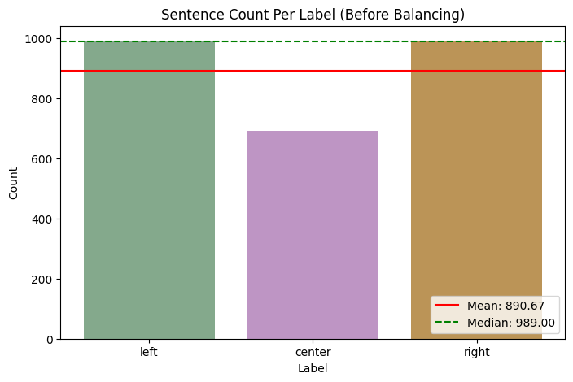

As seen in the bar chart, there is a huge imbalance in the classes of the BABE dataset. Particularly, the 'center' class is highly under represented in the Dataset. The Mean (red line) is below the median (green dashed line) indicating a negative skew. 

To address this imbalance, a typical approach would be to oversample or undersample the different classes in the hopes of correcting the skew without introducing undesired behaviour. Thanks to the earlier donor Dataset integration and preperation, the UniFeed model completely avoids undersampling and oversamlping. As outlined in the previous stages, the 'political-bias' Dataset has been modified to be a suitable donor for 'center' classes to fill in the missing BABE entries. 

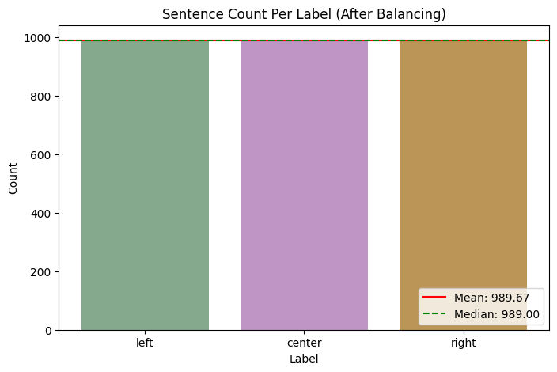

After merging both datasets, the skew is completely removed with Mean and Median values being almost equal. The potential negative impacts this merge may have had such as: introducing a skew in sentence lengths, or duplicate values were considered and addressed before the merge by performing cleaning and integration operations on both datasets. 

Further details on the preparation of the donor dataset can be seen in the Dataset Cleaning stage. The metrics of the merged Dataset can be seen in the 'after' images of the Dataset Analysis stage to verify that this merge did not have any negative impacts on the integrity of the dataset.

## 6.6. Advanced Dataset Analysis

### 6.6.1. Overview

At this point the dataset is clean and balanced. To further explore the contents of the dataset. The goal here is to understand the contents of each sentence. The ideal outcome is that the discovers will offer insights on how to expand the dataset in the future, or what kind of data serves as the best input, and if there are any more meaningful features that can be extracted to improve the performance of the model.

### 6.6.2. Sentence Length Distribution

|Statistical Measure | Left | Center | Right |
| ---- | ---- | ---- | ---- |
| Count | 991 | 988 | 989 |
| Mean | 31.90 | 34.01 | 32.90 |
| Standard Deviation | 12.03 | 12.17 | 12.81 |
| Minimum | 9 | 9 | 9 |
| Maximum | 80 | 88 | 85 |

**Findings** 
1. **Average Sentence Lengths:** The mean sentence length is highest for Center labelled sentences (~34 words), followed by Right (~33 words) and Left (~32 words). This suggests that Center sentences tend to be slightly longer on average. The average word counts for each label are quite close to one another, indicating a good balance of different sentence length representations for all 3 ideologies.

2. **Variability in Sentence Lengths:** The standard deviation for each label are quite equal at 12.03, 12.17, and 12.81 for Left, Center, and Right respectively. This indicates a nearly equal variability in the length of the sentences across all three labels and a good balance.

3. **Range of Sentence Lengths:** The maximum sentence length is slightly lower for Left sentence at 80 for Left, 88 for Center, and 85 for Right. The min for all three labels are equal at 9 words. Like the other metrics, the range is also quite balanced. That being said, it is the least balanced finding with an 8 word Max difference between Left and Center. This difference should be highlighted and kept note of in case it has a meaningful impact on the performance of the model. 

### 6.6.3. Distribution of Sentences Containing an Entity

|Label|No. of Sentences|Percentage of Sentences|
|:--|--:|:--|
|Left|877|88.67%|
|Center|927|93.82%|
|Right|892|90.01%|

**Findings** 
1. Entities are highly represented across all sentences in the Dataset. 
2. The model is highly trained against sentences containing an entity. This indicates that presence of an entity in a sentence informs that sentence is likely a suitable input for the model. 

### 6.6.4. Count of Entity Types Mentioned in Sentences

[SpaCY Entity Type Glossary](https://www.newscatcherapi.com/blog/named-entity-recognition-with-spacy)
- DATE - Absolute or relative dates or periods
- PERSON - People, including fictional
- GPE - Countries, cities, states
- LOC - Non-GPE locations, mountain ranges, bodies of water
- MONEY - Monetary values, including unit
- TIME - Times smaller than a day
- PRODUCT - Objects, vehicles, foods, etc. (not services)
- CARDINAL - Numerals that do not fall under another type
- ORDINAL - "first", "second", etc.
- QUANTITY - Measurements, as of weight or distance
- EVENT - Named hurricanes, battles, wars, sports events, etc.
- FAC - Buildings, airports, highways, bridges, etc.
- LANGUAGE - Any named language
- LAW - Named documents made into laws.
- NORP - Nationalities or religious or political groups
- PERCENT - Percentage, including "%"
- WORK_OF_ART - Titles of books, songs, etc.

**Entity Type Occurrence by Label**

|Entity Type|Left|Center|Right|Total|
|:--|--:|--:|--:|--:|
|ORG|698|744|588|2030|
|PERSON|462|662|581|1705|
|GPE|387|657|445|1489|
|DATE|362|699|392|1453|
|NORP|333|338|491|1162|
|CARDINAL|144|261|159|564|
|ORDINAL|41|65|39|145|
|TIME|30|54|30|114|
|MONEY|27|52|34|113|
|LOC|24|42|37|103|
|FAC|19|33|18|70|
|WORK_OF_ART|26|23|21|70|
|PERCENT|19|26|23|68|
|EVENT|13|18|19|50|
|LAW|20|12|14|46|
|PRODUCT|12|16|13|41|
|QUANTITY|1|10|5|16|
|LANGUAGE|0|1|1|2|

**Findings**
1. Organizations (ORG), People (PERSON), Countries/Cities (GPE), and Nationalities or Religious Identities (NORP) are present in the top 5 mentioned entities across all labels.
2. The Center label has a more balanced representation of entity types, whereas the Left and Right ideologies have a stronger focus on organizations and people.
3. The Center's balance in referencing entities across almost all categories could suggest a broad focus on various aspects of discourse. The Right's focus on persons and NORPs could reflect concentration on individual and group identities, while the Left's lower mention of entities might imply a focus on more abstract content rather than specific entities.

## 6.7. Adjective Usage Across Political Ideologies

### 6.7.1. Word Clouds Showing Most Common Adjectives Per Label

**Most Common Adjectives in Left Sentences**

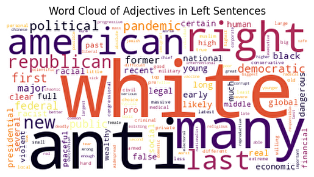

**Most Common Adjectives in Center Sentences**

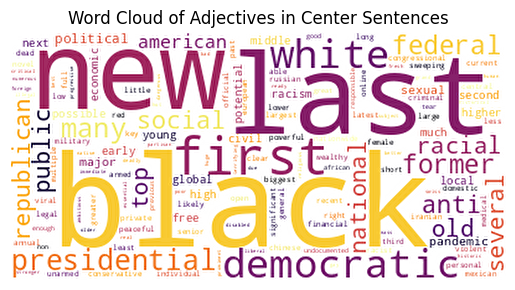

**Most Common Adjectives in Right Sentences**

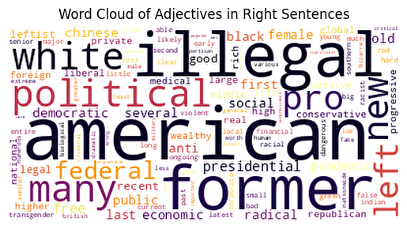

**Findings**

1. There is variety in the frequency of adjective word choices across all ideologies.
2. A handful of adjectives stand out greatly above the others for each ideology. 
3. The differences in the adjectives used, and their relative prominence showcase different focuses and concerns for the different ideological perspectives. 
### 6.7.2. Overlap of Adjective Usage Across All Ideology Labels

**Venn Diagram of Adjective Overlap Across All Classes**

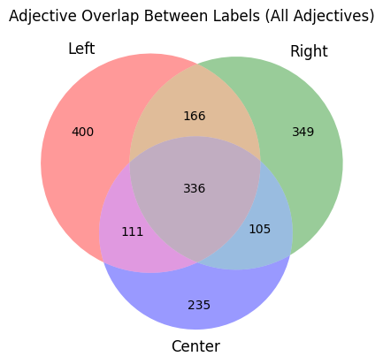

**Findings**
1. Each label has a significant number of adjectives that they exclusively use with 400 Left only adjectives, 349 Right, and 235 Center. With the Left and Right labels having a larger exclusive adjective vocabulary.
2. The ideological groups share a common core of adjectives, as indicated by the intersection of all three circles where 336 adjectives are used by all three groups. This suggests there is a shared vocabulary that transcends ideological boundaries.
3. The adjective usage across ideological labels demonstrates both  diversity and unity present in political language.

## 6.8. Model Training
### 6.8.1. Overview

- **Model Type:** SetFit
- **Sentence Transformer body:** [BAAI/bge-small-en-v1.5](https://huggingface.co/BAAI/bge-small-en-v1.5)
- **Classification head:** a [LogisticRegression](https://scikit-learn.org/stable/modules/generated/sklearn.linear_model.LogisticRegression.html) instance
- **Maximum Sequence Length:** 512 tokens
- **Number of Classes:** 3 classes
## 6.9. Evaluation Metrics

- **Accuracy**: The proportion of true results (both true positives and true negatives).
- **Recall**: The proportion of actual positives that are correctly identified.
- **Precision**: The proportion of positive identifications that are actually correct.
- **F1**: The harmonic mean of precision and recall.

## 6.10. Evaluation Results

| Label | Accuracy | Precision | Recall | F1 |
| :--- | :--- | :--- | :--- | :--- |
| **all** | 0.7010 | 0.7024 | 0.7010 | 0.7016 |

## 6.11. Limitations / Biases

The UniFeed model dataset has quite a few limitations and biases. There are inherent biases in the sentences trained from, such as biases in topic selection, regional focus, media sources, and representation of different social groups.

Some limitations/biases include:
1. It is only trained on English sentences.
2. It is incredibly American centric with almost all of the training data being from American news sources.
3. Most of the sentences are from around 2021. Language evolves over time, any changes in how people are biased, what they are biased to or who they are biased towards are not captured. The hope is that in the future, data collected from the results of the model being run on newly released articles can be used to retrain and evolve the bias detection over time.
4. The model relies solely on text data, it misses biases present in other forms of media such as images, videos, or audio that may exist within an article. While these aspects are outside of the current scope of this project, in the future may be a powerful in aiding the overall goal of detecting biased articles. 

## 6.12. Reproducibility

### 6.12.1. Training Hyperparameters

- batch_size: (32, 32)
- num_epochs: (200, 200)
- max_steps: -1
- sampling_strategy: oversampling
- num_iterations: 1
- body_learning_rate: (2e-05, 1e-05)
- head_learning_rate: 0.01
- loss: CosineSimilarityLoss
- distance_metric: cosine_distance
- margin: 0.25
- end_to_end: False
- use_amp: True
- warmup_proportion: 0.1
- seed: 326
- run_name: unifeed_bias_training
- eval_max_steps: -1
- load_best_model_at_end: True

### 6.12.2. Framework Versions

- `Python: 3.10.12`
- `SetFit: 1.0.3`
- `Sentence Transformers: 2.3.1`
- `Transformers: 4.37.2`
- `PyTorch: 2.1.0+cu121`
- `Datasets: 2.17.1`
- `Tokenizers: 0.15.2`

### 6.12.3. Library Versions

- `python==3.10.12`
- `setFit==1.0.3`
- `sentenceTransformers: 2.2.2`
- `tansformers==4.35.2`
- `datasets==2.16.1`
- `transformers==4.35.2` 
- `huggingface-hub==0.20.3` 
- `setfit==1.0.3` 
- `spacy==3.6.1` 
- `spacytextblob==4.0.0` 
- `matplotlib==3.7.1` 
- `pandas==1.5.3`
- `numpy==1.23.5` 
- `textblob==0.15.3` 

### 6.12.4. Dataset Split

80 / 20 training validation split.

Splitting was random with the seed '326' for deterministic reproducibility.

# 7. Deployment and Testing

## 7.1. Dockerization

The UniFeed application is containerized using Docker. This is to simplify the deployment process and ensures consistent environments across different stages of development.

### 7.1.1. UniFeed Dockerfile

UniFeed's Dockerfile for the application server is based on `python:3.12.0-slim`. This DockerFile sets up a Python environment, installs necessary dependencies, and prepares the application for execution. Key steps include:

- Setting Python environment variables to optimize the Docker container.
- Copying the application files and requirements into the container.
- Installing PostgreSQL client, build essentials, and `libpq-dev` for PostgreSQL database interaction.
- Creating a Python virtual environment and installing all the dependencies listed in `requirements.txt`.
- Downloading and setting up spaCy with the `en_core_web_sm` model for natural language processing tasks. This is essential for the `find_ideal_sentences` function as it allows UniFeed to use NLP to process article text and extract desired features.
- Removing unnecessary packages and cleaning up to reduce the final image size.
- Setting up user and directory permissions for security and resource management.
- Defining entry points and commands to run the application.

### 7.1.2 Proxy Dockerfile

For the deployment envrionment, UniFeed builds a second Dockerfile for the nginx proxy server. This Dockerfile mostly uses the default nginx-unprivileged image, with the notable changes being:
1. The Dockerfile runs a script `scripts/run.sh` with Django related configurations such as using `manage.py` to collect static files, waiting for the PostgreSQL database to reply, and applying any database migrations. 
2. It executes uWSGI to provide a WSGI socket for the proxy server to use and speak with the Django app on port 9000.
3. Four workers are deployed for the UniFeed deployment website to handle multiple requests to the server at once.

### 7.1.3. Docker-Compose

UniFeed uses two `docker-compose.yml` files for different environments:

1. **Development Environment (`docker-compose.yml`):**
   - Comprises services like `app`, `db` (Postgres), `redis`, and `celery`.
   - The `app` service builds the Dockerfile and sets up the web server, linking it to other services like `db` and `redis`.
   - Environment variables are set for database connectivity, debug mode, and API keys.
   - Ports are mapped for local access, and volumes are used for persistent data storage and code synchronization. So when a change is made on the environment running the Docker daemon, the container matches the update.

2. **Production Environment (`docker-compose-deploy.yml`):**
   - This is the Docker compose file that is used on the production server. 
   - It does not build a `db` (Postgres) container, as the live environment remotely connects to a Postgres database hosted on DigitalOcean.
   - The Proxy Dockerfile is built in this compose as the live server requires nginx for delivering content securely to multiple users.
   - Environment variables are fully obscured by using a .env file in (created in the folder that contains the compose on the DigitalOcean server) to pass environment variables discretely. 

## 7.2. CI/CD Pipeline

UniFeed uses Jenkins for its  Continuous Integration and Continuous Deployment (CI/CD) pipeline. The Jenkins environment is also hosted on DigitalOcean under a separate server. It is setup to communicate with the Docker daemon using a socket. The pipeline is multi-branch meaning it monitors all branches of the UniFeed repo. It performs  automated builds, testing, linting, and deployment. The Jenkins server is configured to respond to changes in the GitLab repository using webhooks. This means  that every code update is automatically processed through the stages outlined in the Jenkinsfile. The Jenkins server also communicated back to GitLab to keep it updated on the status of the pipeline so that it can be viewed in the repo. Here's an overview of each stage in the pipeline:

* **Stage 1. Preparation**
	- The pipeline begins with setting up the environment. It ensures that any previously running Docker containers are stopped and removed. This is to prevent collisions / conflicts and clean up any potential remaining files from previous builds.
* **Stage 2. Build**
	- This stage builds the development version of UniFeed using `docker-compose.yml`. This is to make sure that the Docker image has no issues building and prepares the container so that it can run the next stages in a local environment away from the production database. If there are any issues building, the pipeline updates the GitLab commit status to 'failed' and terminates the process.
* **Stage 3. Linting Templates**
	- Linting is performed on Django templates to ensure code quality and adherence to standards. The pipeline uses the local  UniFeed container and deploys `djlint` to lint the templates. If any errors are detected, the pipeline updates the GitLab commit status to 'failed' and terminates the process.
* **Stage 4. Test**
	- The pipeline executes the application tests using Django's test framework. Test results are logged, and any failures or errors will result in the pipeline marking the GitLab commit status as 'failed' and stopping the process.
* **Stage 5. Deploy**
	* At this point, if the pipeline was executed for a branch that isn't `main` the pipeline has succeeded. If this is the `main` branch, then Jenkins begins the deployment process to push the changes to the live server.  This involves SSHing into the remote server, pulling the latest changes from the repository, and restarting the application using Docker Compose. The deployment script handles the stopping of old servers, freeing up ports, and starting new Docker containers. The GitLab commit status is updated based on the success or failure of the deployment script.

## 7.3. Unit Tests

### 7.3.1. Accounts Tests

**Models**
- `test_add_new_user`: Tests adding a new user.
- `test_track_history_disable_deletes_articles`: Tests if disabling track history deletes associated articles.
- `test_unique_email_constraint`: Checks the enforcement of unique email constraints.
- `test_unique_username_constraint`: Checks the enforcement of unique username constraints.
- `test_user_model_exists`: Verifies the existence of the user model.
- `test_user_track_history_default_false`: Checks if the default track history setting is false.
- `test_user_with_invalid_email_raises_error`: Tests if invalid email raises an error.

**LoginTest**
  - `test_login_page_correct_response`: Checks if the login page is correctly returned for the login route.
  - `test_user_login_form_has_expected_fields`: Ensures the login form has username and password fields.
  - `test_login_with_invalid_user`: Tests login functionality with an invalid user.
  - `test_login_with_valid_user`: Tests login functionality with a valid user.

 **LogoutTest**
  - `test_logout_view_logs_user_out`: Ensures the logout view logs the user out.

**RegistrationTest**
  - `test_registration_page_correct_response`: Checks if the registration page is correctly returned.
  - `test_user_registration_form_has_expected_fields`: Ensures the registration form has expected fields.
  - `test_user_registration_form_succesful_validation`: Tests successful form validation with valid data.
  - `test_user_registration_form_writes_to_database`: Ensures form data is correctly written to the database.
  - `test_registration_post_request_with_valid_data`: Tests registration POST request with valid data.
  - `test_user_registration_form_with_invalid_username`: Checks form validation for invalid usernames.
  - `test_user_registration_form_with_invalid_email`: Checks form validation for invalid emails.
  - `test_user_registration_form_with_invalid_password`: Tests password validation for common issues.
  - `test_user_registration_form_with_mismatched_password_verification`: Ensures password mismatch is caught.

**AccountSettingsTest**
  - `test_form_remove_default_password_field`: Checks if the password field is removed from the settings form.
  - `test_form_reject_password_mismatch`: Tests form validation for password mismatches.
  - `test_form_reject_invalid_password`: Ensures invalid passwords are rejected.
  - `test_form_change_username`: Tests functionality to change a user's username.
  - `test_form_change_email`: Tests functionality to change a user's email.
  - `test_form_change_password`: Tests functionality to change a user's password.

### 7.3.2. AI Analysis Tests

**AIAnalysisUtilsTests**
  - `test_generate_text_md5`: Tests MD5 hash generation for a given text.

**AIAnalysisModelTests**
  - `article_analysis_results_model_exists`: Checks if the ArticleAnalysisResults model exists.
  - `test_add_new_article_analysis_results`: Tests adding new analysis results.

**test_political_bias_analysis_post_json**
  - `test_analyse_political_bias_api_post_exists`: Checks if the POST request for bias analysis exists.
  - `test_analyse_political_bias_api_post_new_data`: Tests posting new data for analysis.
  - `test_detect_political_bias_api_post_invalid_url`: Tests POST request handling for invalid URLs.

**ScraperTests**
- `test_scaper_bad_url_response`: Tests the scraper's response to a bad URL.
- `test_scaper_non_existent_url_response`: Tests the scraper's response to a non-existent URL.
- `test_scaper_succesful_response`: Tests the scraper's successful response.

### 7.3.3. Articles  Tests

**ArticleModelTest**
  - `test_article_creation`: Tests the creation of articles.

**TestArticleImport**
  - `test_clean_rss_entries`: Tests the cleaning of RSS feed entries.
  - `test_read_rss_feed`: Ensures RSS feeds are correctly read and processed.

### 7.3.4. Feeds Tests

**FeedFolderModelTest**
  - `test_user_create_folder`: Tests creating a new feed folder.
  - `test_add_unique_folders`: Checks adding unique folders.
  - `test_folder_name_must_be_unique`: Ensures folder names must be unique per user.

**FeedModelTest**
  - `test_feed_creation`: Tests feed creation.
  - `test_last_updated_default`: Checks if the last updated timestamp is correct.

**UserFeedModelTest**
  - `test_create_user_feed`: Tests creating a user feed.
  - `test_user_feed_custom_name_and_description`: Checks custom naming and description for user feeds.

**RssFeedImportTest**
  - `test_read_rss_entries`: Validates reading entries from an RSS feed.
  - `test_read_rss_feed`: Ensures that the RSS feed can be read successfully.

**ViewTests**
  - `test_my_feed_view`: Tests the 'my feed' view.
  - `test_get_add_user_feed_to_folder`: Ensures correct response for adding a user feed to a folder.
  - `test_post_add_user_feed_to_folder_with_valid_data`: Tests adding a user feed to a folder with valid data.
  - `test_post_add_user_feed_to_folder_with_valid_url`: Checks adding a user feed with a valid URL.
  - `test_post_add_user_feed_to_folder_with_invalid_url`: Tests handling of invalid URLs when adding feeds.
  - `test_post_add_user_feed_to_folder_with_invalid_data`: Ensures invalid data is handled correctly.
  - `test_post_add_duplicate_user_feed_to_folder`: Tests handling of duplicate user feeds in a folder.

# 8. Problems and Resolutions

## 8.1. Scalability and Performance 

### 8.1.1. Problem

Intensive tasks like web scraping and AI analysis will quickly overload the server if handled synchronously, especially with multiple users accessing the service simultaneously. By default Django is completely synchronous and unsuitable for the type of processing that an app like UniFeed performs.

As the number of users grows, a large number of users performing read and write operations simultaneously can lead to concurrency issues, resulting in inconsistent data states or errors. the volume of data to store and query also increases. This can lead to slower database responses and increased load times if the database is not optimized.

### 8.1.2. Solution

**Asynchronous Tasks**: UniFeed utilizes Celery and Redis to asynchronously perform resource-intensive tasks such as scraping article content and analysing article. This means that these functions are offloaded to worker processes, which can be scaled independently from the web server processes​​​​​​. The `@shared_task` decorator above tasks marks them for distribution among multiple worker nodes, improving the horizontal scalability of UniFeed as the load increases. Tasks can be retried in the case of temporary issues, making the functions more reliable and robust​​. The system has a scheduled task to update RSS feeds regularly but ensures that updates are not performed too frequently by storing the RSS feed `ttl` to ensure that the updates are spaced out appropriately. Each `UserFeed` object reads from a core `Feed` object so this update process is only run a single time even if many users are using the same feed.

**PostgreSQL Database:** By default, Django is configured to use SQLite as its database. UniFeed made the switch to PostgreSQL which is much more scalable and performant. This ensures that as the complexity and demand of UniFeed grows, it has a robust database to efficiently query, store objects, and update. UniFeed also takes advantage of indexing for fields such as the `article_text_md5` in the `ArticleAnalysisResults` model to speed up lookups, which  crucial as the data grows​​.

## 8.2. Continuous AI Improvement 

### 8.2.1. Problem

Political ideologies are constantly evolving depending on events, and world news. It is essentially guaranteed that UniFeed will need to have some form of continuous data collection and training to both improve the model, and keep it up to date with changes in ideological speech. 

### 8.2.2. Solution

UniFeed implements a "thumbs up / thumbs down" feedback mechanism for every sentence analysis, which is managed by the `AIAnalysisFeedback` model. When a political bias analysis is performed, the users can see a breakdown of each sentence analysis in a report. From here, they can choose to 'agree' or 'disagree' with the outcome. Their feedback is saved to the database. 

In the future as user feedback builds up, it becomes very valuable data that can improve the model. For example the database can be queried for all sentence feedbacks and rank them by number of votes. If there is a sentence with 200 agrees, it is likely that the assessment was accurate. The final decision could be determined by an expert as to whether or not the user assessment is correct. If it is, then that sentence could be added to the dataset as an exemplar for the political label it is associated with. On the contrary, if the sentence had 200 disagrees, an expert could determine the true label it should have been assigned and place it into the dataset with the corrected label. The model could then be retrained and redeployed seamlessly as it uses HuggingFace's repo and API so no configurations will need to be changed - the newly trained AI would simply need to be committed on top of the pre-existing one and UniFeed will seamlessly begin to use it. 

## 8.3. Scraping Target Variation

### 8.3.1. Problem

One of the most difficult aspects when developing the UniFeed web app was the inconsistent and volatility of importing user generated content. RSS feeds and articles can come in various formats and structures, often inconsistent.  Some news websites are pay walled, some use JavaScript to render their frontend, some ban scrapers all together. Websites can go offline, articles can be moved or deleted, RSS feeds can have outdated formatting. For example CBS News (one of America's biggest news organizations) uses RSS 1.0 standard for some of their feeds (released over 20 years ago). 

## 8.4. Solution

Error handling was at the forefront of UniFeed's scraping process. Inaccessible websites, changes in website structures, or paywalled content are caught in the initial scraping phase and an error is displayed to the user. These incidents are logged as some newly encountered structures can inform updates to UniFeed so that its structure can be captured going forward.

UniFeed uses a function called `clean_rss_entries` to process and standardize RSS feed entries. This function combined with the python `feedparser` library ensures that each entry has a consistent format, regardless of the original RSS feed's structure. It involves:
- Handling different image formats in the RSS feed, ensuring the correct image URL is extracted, even if provided as a list.
- Standardizing key fields such as 'title', 'link', 'description', 'author', and 'image_url'. If any of these fields are missing, default values are provided to maintain consistency.
- Using a fallback mechanism for images. If no specific image is found for an article, the feed's default image is used. If that is also unavailable, a placeholder image is generated that displays the feed's name​​.

 UniFeed checks for and respects `robots.txt` files on websites using a `check_robots` function, ensuring ethical scraping practices. It does so by using the `tldextract` python library to extract the TLD of the URL being scraped. From here, "/robots.txt" is appended such as: `protocol:TLD:/robots.txt` to locate the robots file and seek permission to scrape the requested path under the agent "UnifeedAgent".
 
# 9. Installation Guide

## 9.1. Prerequisites

- Git
- Docker
- Docker Compose
- Python 
- pip (Python package installer)

## 9.2. Installation Steps

1. **Clone the UniFeed repository**
	* `git clone https://gitlab.computing.dcu.ie/tallonj3/2024-ca326-unifeed.git`
2. **Fork the UniFeed Political Bias model on HuggingFace**
	*  https://huggingface.co/JordanTallon/Unifeed
3. **Update the HUGGINGFACE_API_URL setting** 
	* Found in `project_files/unifeed/settings.py`. Change the URL to your forked repo.
3. **Generate a HuggingFace API Key**
	* Located in your HuggingFace account settings. The API key needs read permissions
4. **Navigate to the UniFeed code directory**
	* `cd code`
5. **Configure Environment Variables**
	* Copy the environment sample file `.env.sample` to a new `.env` file.
	* Update the `.env` file with your specific variables: `DB_HOST`, `DB_PORT`, `SECRET_KEY`, `HUGGINGFACE_API_KEY`
6. **Build and run docker-compose.yml for the development environment**
	* `docker-compose up --build`
	* This will start the Django application, PostgreSQL database, Redis, and Celery worker as services.
	* Once the Docker containers are running, access the application by navigating to `http://localhost:8000/` or `http://127.0.0.1:8000/` in your web browser.
7. **(Alternatively) build and run docker-compose-deploy.yml for the production environment** 
	* `docker-compose up -f docker-compose-deploy.yml --build`
	* This will start the Django application, Nginx Proxy, Redis, and Celery worker as services.
	* UniFeed will run on port 80 of your server by default.

**Note:** If you wish to run UniFeed outside of a docker container (not recommended) make sure to run `pip install requirements.txt` first. If there any issues after installation consult the UniFeed development container log. It is configured to display integration errors with HuggingFace and output logs from all of its services.
